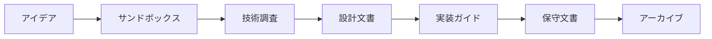

# ドキュメント整理計画

> **最終更新**: 2025-06-22
> **カテゴリ**: Planning
> **関連文書**: [README](README.md), [ドキュメント作成標準](documentation-standards.md)

## 概要

プロジェクトのドキュメントが増加してきたため、今後の拡張を見据えた整理計画を策定します。

## 現状の分析

### 現在のドキュメント数
- 合計: 15ファイル
- カテゴリ別:
  - プロジェクト計画: 5
  - アーキテクチャ: 3
  - 技術比較/調査: 5
  - 実装ガイド: 2

### 課題
1. フラットな構造でファイルが増加
2. カテゴリが一目で分かりにくい
3. 関連ドキュメント間のリンクが不明確

## 短期的な対応（現在実施済み）

1. **README.mdの作成**
   - ドキュメント一覧とカテゴリ分類
   - 各ドキュメントへのリンク
   - 簡潔な説明

2. **ドキュメント作成標準の策定**
   - 統一されたテンプレート
   - 命名規則
   - メタデータの追加

3. **開発ガイドラインの拡充**
   - サンドボックス管理方法の文書化
   - ドキュメント化のタイミング

## 中期的な計画（ファイル数が20を超えたら）

### ディレクトリ構造への移行

```
docs/
├── README.md
├── documentation-standards.md
├── planning/
│   ├── development-plan.md
│   ├── mvp-implementation-plan.md
│   ├── revised-mvp-plan.md
│   └── final-implementation-plan.md
├── architecture/
│   ├── system-architecture.md
│   ├── local-first-architecture.md
│   └── cross-platform-consideration.md
├── decisions/
│   └── technical-decisions.md
├── research/
│   ├── speech-recognition-comparison.md
│   ├── wake-word-detection-comparison.md
│   └── wake-word-technical-overview.md
└── guides/
    ├── development-guidelines.md
    ├── openwakeword-guide.md
    └── custom-wake-word-guide.md
```

### 移行時の作業

1. **リダイレクト用README**
   - 各旧ファイルの新しい場所を明記
   - 一定期間後に削除

2. **リンクの更新**
   - 相互参照の修正
   - 外部からのリンクの確認

## 長期的な方針

### 1. ドキュメントの種類と保管場所

| 種類 | 場所 | 例 |
|------|------|-----|
| プロジェクト全体 | `/docs` | アーキテクチャ、計画書 |
| 機能別詳細 | `/src/[feature]/docs` | 各機能の詳細設計 |
| サンドボックス | `/sandbox/[feature]/` | 実験的実装の記録 |
| API仕様 | `/api/docs` | OpenAPI仕様書 |

### 2. ドキュメントのライフサイクル



### 3. 自動化の検討

- **目次の自動生成**: スクリプトでREADME.mdを更新
- **リンクチェック**: CIでリンク切れを検出
- **テンプレート適用**: 新規ドキュメント作成時の自動化

## 実施スケジュール

- [x] Phase 1: 現状整理とREADME作成（完了）
- [x] Phase 2: 標準化ドキュメント作成（完了）
- [ ] Phase 3: 既存ドキュメントへのメタデータ追加
- [ ] Phase 4: ディレクトリ構造への移行（必要時）
- [ ] Phase 5: 自動化ツールの導入

## まとめ

ドキュメントの整理は継続的なプロセスです。現在は管理可能な規模ですが、将来の拡張に備えて標準化と計画を策定しました。プロジェクトの成長に合わせて、この計画も更新していきます。